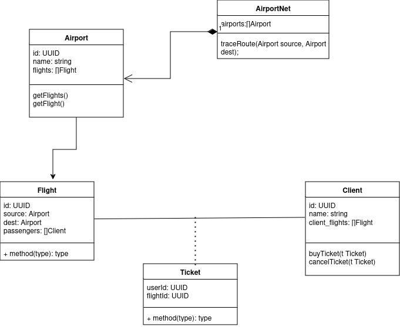
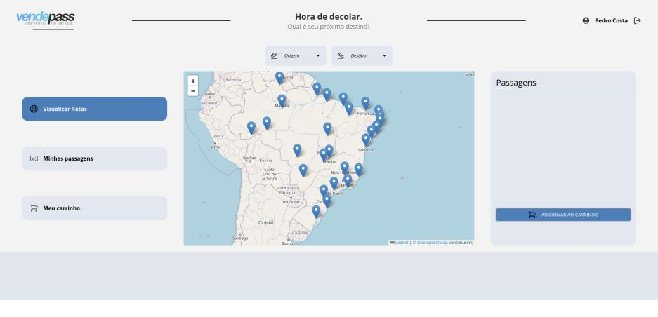
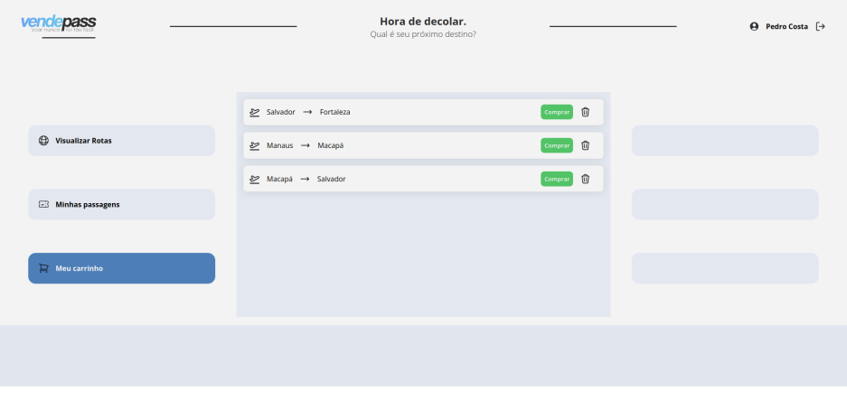
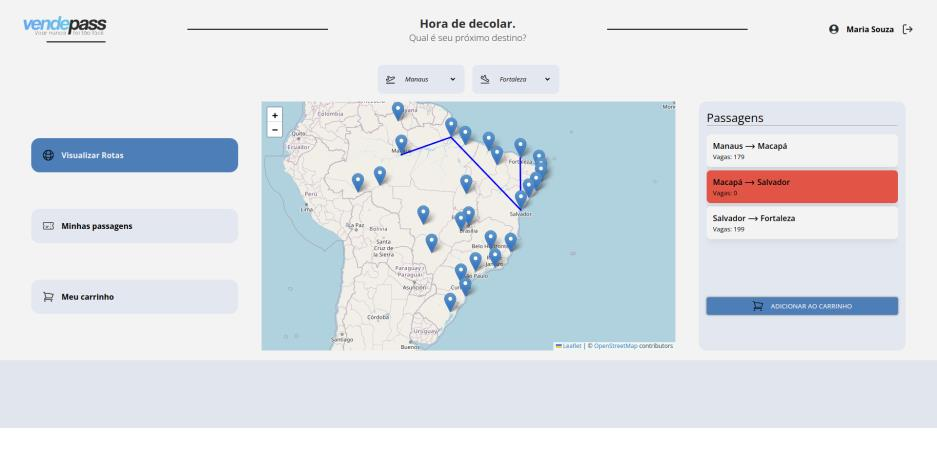

<h1 align="center">VendePass</h1>
<h2 align="center">Sistema de Vendas de Passagens Aéreas Baseado na Arquitetura TCP Cliente-Servidor</h2>

### Equipe

 [Valmir Nogueira](https://github.com/valmirnogfilho)

 [Pierre Machado](https://github.com/pierremachado)

### Introdução

É evidente que houve uma crescente demanda para que as empresas se adaptem ao rápido crescimento do comércio virtual nos últimos anos, já que os sistemas de compras online oferecem conforto aos clientes que buscam agilidade e preços acessíveis. Um dos setores que mais se destaca nesse cenário é o das companhias aéreas, que, através de plataformas automatizadas, proporciona interações rápidas e práticas para a compra de passagens. Em vista disso, uma empresa aérea identificou a necessidade de implementar um sistema mais eficiente para pesquisar rotas e vender passagens, de modo a otimizar a experiência do cliente e aumentar a competitividade no mercado. 

Neste contexto, este relatório visa detalhar o desenvolvimento de um sistema de compra e venda de passagens aéreas pela internet, utilizando o protocolo TCP/IP e a arquitetura cliente-servidor. A solução proposta baseia-se no uso dos pacotes da linguagem de programação Go para a implementação do servidor e a comunicação com o cliente, a criação de uma API baseada no protocolo de solicitações HTTP e a framework React do JavaScript para o front-end. O sistema foi dockerizado e testado extensivamente, tratando requisições de clientes com paralelismo. A solução atendeu aos requisitos propostos e resultou em um projeto funcional e robusto. 

### Arquitetura da solução

A solução adotada utilizou a arquitetura de comunicação cliente-servidor. No modelo cliente-servidor, o cliente é o programa que faz solicitações, enquanto o servidor é o responsável por responder a essas solicitações. A comunicação entre ambos ocorre por meio de protocolos, como o Transmission Control Protocol (TCP), que garante a entrega confiável de dados na internet, mesmo em redes instáveis. O uso do protocolo TCP garante a integridade e a ordem dos pacotes, algo crucial em um sistema de compra de passagens, onde a precisão dos dados trocados é essencial para evitar inconsistências, como reservas duplicadas ou falhas de processamento. 

O servidor do projeto foi desenvolvido utilizando as bibliotecas da linguagem de programação Go, que oferece ferramentas nativas para a criação de servidores eficientes. A linguagem de programação Go é particularmente vantajosa para lidar com múltiplas requisições, graças às goroutines e aos channels. As goroutines são threads leves que permitem executar múltiplas tarefas simultaneamente, otimizando o desempenho do servidor através do paralelismo. Já os channels atuam como canais de comunicação entre goroutines, garantindo a sincronização e evitando condições de corrida. Isso é fundamental em situações em que vários clientes tentam reservar os mesmos assentos, onde transações atômicas são necessárias para assegurar que cada reserva seja processada de forma única e consistente. 

Além disso, foi implementado um banco de dados utilizando o padrão Data Access Object (DAO). Embora a linguagem Go não seja orientada a objetos por natureza, é possível simular a orientação a objetos por meio de estruturas (structs). Com base em um diagrama de classes, foram criadas estruturas para representar entidades reais, como cliente, aeroporto, voo e sessão, e seus respectivos relacionamentos. Por exemplo, a estrutura de voo armazena dados sobre o aeroporto de origem, aeroporto de destino e a quantidade de assentos disponíveis, permitindo o gerenciamento eficaz de reservas e rotas. 

Figura 1. Diagrama de classes inicial do projeto

O cliente foi desenvolvido utilizando o framework React no JavaScript, que é amplamente utilizado para a construção de interfaces de usuário interativas e dinâmicas. O React facilita a criação de componentes reutilizáveis e a atualização eficiente da interface com base nas interações do usuário, permitindo o desenvolvimento ágil do front-end do projeto. Através de uma interface gráfica projetada no Figma e desenvolvida no framework React junto ao CSS, o cliente é capaz de realizar login, escolher rotas, adicionar as rotas ao carrinho e confirmar a compra. 

Figura 2. Tela de login 

Figura 3. Tela inicial após login 

A comunicação entre o front-end e o back-end ocorre por meio de uma Interface de Programação de Aplicativo (Application Programming Interface, API) desenvolvida em Go, utilizando a biblioteca net. O cliente envia requisições HTTP para a API, que por sua vez converte essas requisições para um formato que o servidor possa processar, permitindo que operações como a pesquisa de rotas e a compra de passagens sejam realizadas de forma eficiente e segura. 

Figura 4. Fluxograma de vendas do serviço 

### Paradigma de comunicação

Existem dois tipos de paradigma de comunicação: stateful e stateless. No paradigma de comunicação stateful, o sistema mantém o registro das interações do usuário ao longo de suas sessões, permitindo que cada nova solicitação seja tratada com base no histórico de solicitações anteriores. Isso possibilita uma experiência mais interativa e personalizada, como quando o sistema “lembra” de itens colocados no carrinho ou o estado de uma transação em andamento. Já no paradigma stateless, cada solicitação é tratada de forma isolada, sem considerar o histórico de interações do cliente. O servidor não mantém informações sobre o estado da sessão entre uma requisição e outra, o que pode simplificar a escalabilidade do sistema, mas torna necessário que todas as informações relevantes sejam transmitidas a cada nova solicitação. 

Além disso, uma diferença importante entre esses paradigmas está na maneira como as threads são gerenciadas. Em sistemas stateful, há uma maior complexidade no gerenciamento de threads, pois elas precisam lidar com a continuidade do estado da sessão, garantindo que as interações anteriores sejam levadas em conta. No entanto, em sistemas stateless, cada thread trata uma requisição individualmente, sem necessidade de armazenar ou consultar o estado anterior, o que pode facilitar a execução paralela de múltiplas solicitações. 

O paradigma de comunicação adotado para este projeto foi o stateful, devido à necessidade de manter a interatividade e a continuidade da sessão do usuário. O servidor registra as sessões ativas no DAO (Data Access Object) assim que o cliente faz login. Isso é útil, por exemplo, para manter temporariamente as reservas no carrinho de compras, implementando uma fila de preferência. Quando um cliente adiciona uma rota ao carrinho, ele tem 30 minutos para confirmar a compra. Nesse período, a quantidade de assentos disponíveis para o voo é temporariamente reduzida em um, garantindo a reserva parcial até que a transação seja finalizada, expire ou o cliente se desconecte. 

Entretanto, apesar da escolha pelo paradigma stateful, o gerenciamento de threads no sistema segue uma abordagem semelhante ao modelo stateless. No servidor, cada requisição é tratada como uma nova goroutine. Quando uma solicitação chega, uma goroutine é criada especificamente para lidar com ela, garantindo eficiência e paralelismo. A goroutine verifica se o usuário possui uma autenticação válida, utilizando um token associado ao ID do cliente. Esse token serve como um identificador único que permite ao servidor reconhecer a sessão e garantir que o cliente esteja autorizado a realizar a operação solicitada, sem a necessidade de manter uma conexão persistente.

### Protocolo de comunicação

O protocolo de comunicação adotado foi o protocolo Hypertext Transfer Protocol (HTTP). O servidor permanece em um loop infinito, utilizando um listener que "ouve" as requisições dos clientes e as processa conforme chegam. Quando o cliente faz uma solicitação ao servidor, ela é recebida como uma requisição HTTP pela API, que atua como um middleware, intermediando a comunicação entre o cliente e o servidor.  

Os métodos HTTP mais comuns incluem: 

- GET: utilizado para solicitar dados do servidor. Por exemplo, ao pesquisar voos disponíveis, o cliente envia uma requisição GET para receber informações sobre rotas e horários. 

- POST: utilizado para enviar dados ao servidor. Por exemplo, quando um cliente realiza uma compra, as informações da compra são enviadas através de uma requisição POST. 

- PUT: usado para atualizar informações já existentes. 

- DELETE: usado para excluir recursos no servidor, como o cancelamento de uma reserva. 

Após a API receber a solicitação HTTP, ela a traduz para um formato que o servidor possa entender. A API valida os dados e garante que a requisição é bem formada. Em seguida, a API encaminha a solicitação para o servidor, que processa a lógica necessária, como verificar disponibilidade de assentos, validar credenciais de login ou calcular o valor da passagem. Uma vez processada, a resposta do servidor é escrita no buffer da API. Esse buffer armazena temporariamente os dados que precisam ser enviados de volta ao cliente. Após o processamento, a API responde ao cliente com os dados necessários, como a confirmação da compra ou as informações de um voo, utilizando o protocolo HTTP para transmitir essa resposta. 

Esse ciclo garante que a comunicação entre o cliente e o servidor ocorra de forma eficiente e organizada, com a API atuando como uma ponte que gerencia o fluxo de requisições e respostas. 

### Formatação e tratamento de dados

Os dados trocados entre o cliente e a API, e entre a API e o servidor, foram formatados em JavaScript Object Notation (JSON). O formato JSON é amplamente utilizado por ser leve, de fácil leitura e compatível com a maioria das linguagens de programação, incluindo Go e JavaScript. Ele permite a transmissão de estruturas de dados complexas, como objetos e arrays, de forma simples e eficiente. 

No contexto da linguagem de programação Go, o JSON pode ser manipulado através das funções Marshal() e Unmarshal(). A função Marshal() é responsável por converter estruturas de dados, como structs, em um formato JSON. Isso é útil quando o servidor precisa enviar uma resposta para o cliente ou API, pois permite transformar os dados da aplicação em um formato legível para a comunicação HTTP. Já a função Unmarshal() converte dados no formato JSON em estruturas de dados Go. Isso é essencial quando o servidor recebe uma solicitação JSON e precisa interpretá-la, convertendo-a em variáveis manipuláveis pelo código. 

No contexto da implementação do protocolo HTTP, essas funções são extremamente úteis, pois facilitam a conversão de dados entre os formatos utilizados pelo servidor e pela API. Sempre que o cliente envia uma solicitação HTTP com um corpo em JSON, o servidor usa Unmarshal() para decodificar essa solicitação e tratá-la de forma adequada. Da mesma forma, ao retornar uma resposta ao cliente, o servidor utiliza Marshal() para converter os dados da resposta em JSON, que é então enviado via HTTP de forma estruturada e legível. 

Esse processo simplifica a comunicação entre as diferentes camadas do sistema, garantindo que os dados sejam sempre transmitidos de maneira consistente e eficiente entre o cliente, a API e o servidor.

### Tratamento de conexões simultâneas

Com o uso de goroutines, o servidor é capaz de lidar com requisições simultâneas dos clientes de forma eficiente. Quando um cliente realiza login, uma sessão única é criada e associada ao ID desse cliente no DAO de sessões. Isso permite que, em toda solicitação subsequente, uma nova goroutine seja iniciada para processar a requisição de forma paralela. Assim que a operação no servidor é concluída, a goroutine encerra seu processo. 

Para validar as requisições do cliente, é gerada uma string de identificação única que serve como token de autenticação. Esse token é utilizado pelo servidor para garantir que cada solicitação seja proveniente de uma sessão válida e autenticada. Quando o usuário se desconecta, a sessão correspondente ao seu ID é removida do DAO, o que também cancela todas as reservas parciais feitas durante aquela sessão. 

Além disso, o sistema não permite que um mesmo usuário se conecte simultaneamente em múltiplos dispositivos, garantindo que apenas uma sessão ativa esteja vinculada ao ID do cliente a qualquer momento.

### Tratamento de concorrência

Na linguagem de programação Go, as goroutines são sincronizadas por meio de channels. Um channel é um mecanismo de comunicação que permite que goroutines troquem dados entre si de maneira segura e sincronizada. Eles são utilizados para passar informações de uma goroutine para outra, garantindo que o acesso a recursos compartilhados seja controlado e ordenado. Quando combinados com filas e mutexes, os channels permitem gerenciar a concorrência e evitar problemas como condições de corrida, onde múltiplas goroutines tentam acessar o mesmo recurso simultaneamente.

Sem a sincronização adequada entre as goroutines, podem ocorrer erros em cenários de concorrência. Por exemplo, se dois clientes tentarem comprar o último assento disponível em um voo, sem o controle adequado, ambos poderiam acabar conseguindo reservar a mesma passagem, gerando uma inconsistência no sistema. 

Para evitar isso, foram utilizados channels para implementar filas de requisições e mutexes para garantir a exclusão mútua ao acessar recursos compartilhados, como a quantidade de assentos disponíveis. Quando um cliente faz uma solicitação para reservar um assento, o channel controla a ordem das requisições e o mutex garante que apenas uma goroutine por vez possa acessar e modificar os dados do voo. Assim, a concorrência é tratada de maneira segura, prevenindo que dois clientes reservem o mesmo assento ao mesmo tempo. 

Além disso, foi implementada uma etapa extra para aumentar a segurança da reserva, utilizando o conceito de reserva parcial. Quando o cliente adiciona uma passagem ao carrinho, o sistema temporariamente reserva essa passagem para ele até a sua sessão associada expirar ou por até 30 minutos. Durante esse período, a quantidade de assentos disponíveis é subtraída, garantindo que o assento não seja oferecido a outro cliente. Se o cliente desistir da compra ou se desconectar, o assento é liberado, e a quantidade de assentos disponíveis é incrementada novamente, permitindo que outros clientes façam a reserva. Se a compra for efetivada dentro do prazo, a reserva se torna permanente e a quantidade de assentos permanece subtraída. 

Figura 5. Carrinho de um dos clientes.

Figura 6. Indicação de que não é possível reservar um voo já reservado por outro cliente.

### Desempenho e avaliação

Para aumentar o desempenho do sistema, múltiplas goroutines são criadas e executadas em paralelo. Essas goroutines são responsáveis por várias tarefas, como o gerenciamento de reservas, controle de sessões, além de "ouvir" e responder às solicitações dos clientes com consultas aos bancos de dados. O uso de goroutines permite que o servidor lide com muitas requisições simultaneamente, aproveitando o paralelismo e distribuindo as tarefas de maneira eficiente.

Para coordenar essas goroutines e garantir a comunicação segura entre elas, são utilizados channels. Os channels funcionam como um meio de comunicação entre as goroutines, permitindo que dados sejam enviados de uma para outra de forma sincronizada. No contexto do sistema, channels são usados para passar informações, como requisições de reserva ou atualizações de sessão. Dessa forma, o uso de channels e mutexes garante que a execução paralela das goroutines maximize o desempenho e a capacidade de resposta do servidor, tornando-o mais eficiente e escalável. 

### Confiabilidade da solução

O servidor implementa vários mecanismos à prova de falhas para garantir a robustez do sistema. Por exemplo, ele associa um período de inatividade a todas as sessões e registra o último tempo ativo de cada uma. Se o tempo atual ultrapassar o último registro de atividade mais o tempo máximo de inatividade permitido, o cliente é automaticamente desconectado, garantindo que recursos não sejam mantidos ocupados por sessões inativas.

No entanto, o servidor não foi projetado para lidar com encerramentos abruptos. Durante a execução, ele utiliza o DAO (Data Access Object) sem persistência de memória, o que significa que todos os dados em memória são voláteis. Em caso de uma interrupção inesperada, como uma falha de energia ou um erro no sistema, todos os dados em uso são perdidos. Para mitigar essa limitação, o servidor é configurado para recuperar dados mockados do diretório de stubs após ser reiniciado. Essa abordagem permite que o sistema retorne a um estado funcional, embora com dados temporários, o que ajuda a minimizar o impacto da perda de informações durante um encerramento inesperado. 

Embora essa estratégia ajude na recuperação do sistema, é recomendável que, em versões futuras, sejam implementadas soluções de persistência de dados mais robustas, como bancos de dados que garantam a integridade e a persistência dos dados mesmo em casos de falhas no servidor.

### Documentação do código

O código do projeto foi devidamente organizado em diretórios distintos, seguindo o padrão Model-View-Controller (MVC), e documentado em inglês. Essa separação por camadas permite que a lógica de negócio (Model), a interface do usuário (View) e o controle de fluxo de dados (Controller) fiquem isolados, facilitando a manutenção e a evolução do sistema. A documentação das funções foi feita de maneira detalhada, e pode ser consultada com o comando go doc nomeDoPacote para verificar as funcionalidades de cada pacote, ou com o comando go doc nomeDoPacote.nomeDaFuncao para acessar a descrição individual de cada função.

Essa abordagem melhora significativamente a modularização do código. Ao separar as responsabilidades em diferentes pacotes, o código se torna mais organizado e compreensível, facilitando a reutilização de componentes e a adição de novas funcionalidades sem comprometer outras partes do sistema.

### Emprego do Docker

### Conclusão

### Referências

Holz, Leonhard. Well-structured Logic: A Golang OOP Tutorial. Toptal. Disponível em: https://www.toptal.com/golang/golang-oop-tutorial. Acesso em: 22 set. 2024.

MDN Web Docs. HTTP: Overview. Disponível em: https://developer.mozilla.org/pt-BR/docs/Web/HTTP/Overview. Acesso em: 22 set. 2024.

MDN Web Docs. Client-Server Overview. Disponível em: https://developer.mozilla.org/pt-BR/docs/Learn/Server-side/First_steps/Client-Server_overview. Acesso em: 22 set. 2024.

Red Hat. Stateful vs Stateless. Disponível em: https://www.redhat.com/pt-br/topics/cloud-native-apps/stateful-vs-stateless. Acesso em: 22 set. 2024.
